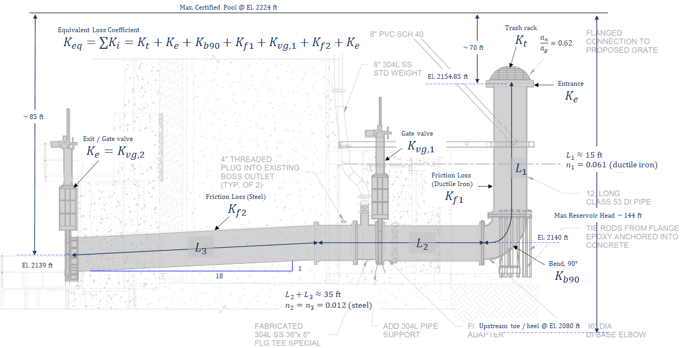
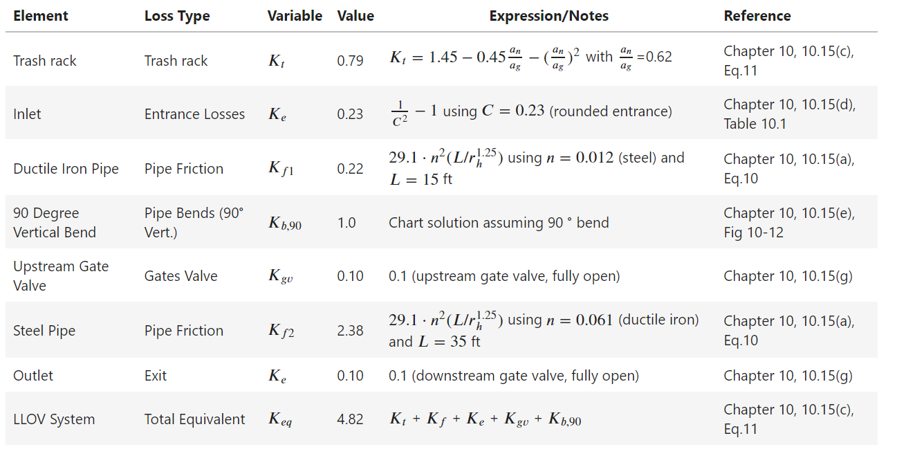

 ```
    ___                       _                         _               _           _                _______
   /   \_ __ __ ___      ____| | _____      ___ __     /_\  _ __   __ _| |_   _ ___(_)___  ---------/       \      
  / /\ / '__/ _` \ \ /\ / / _` |/ _ \ \ /\ / / '_ \   //_\\| '_ \ / _` | | | | / __| / __|         /         \
 / /_//| | | (_| |\ V  V / (_| | (_) \ V  V /| | | | /  _  \ | | | (_| | | |_| \__ \ \__ \        /           \___
/___,' |_|  \__,_| \_/\_/ \__,_|\___/ \_/\_/ |_| |_| \_/ \_/_| |_|\__,_|_|\__, |___/_|___/_____o======\           \
                                                                          |___/                         \==============>___
```
#

A simple `python` class implementation for performing drawdown analysis of dam outlet works using area capacity curves and discharge functions.

## Implementation Notes

* Based on USBR's [Design of Small Dams](https://www.usbr.gov/tsc/techreferences/mands/mands-pdfs/SmallDams.pdf) (1987), Chapter 10, Section 10.14 Pressure Flow in Outlet Conduits.
* This implementation uses the `diameter` (or `area`) and equivalent loss coefficient (`K_eq`) to characterize the drawdown function/discharge of a single outlet.
* A multiplier (`N_mult`) is provided to scale the discharge for additional outlets (e.g., use `N_mult=2` for two identically sized outlets)
* The key discharge (drawdown) function is give by **Section 10, Eq. 8**, where, $Q$ is the discharge, $K_{eq}$ is the equivalent loss coefficient, $A$ is the outlet area, $g$ is the gravitational constant, and $H_T$ is the total head measured from the resevoir pool to the centerline of the outlet: 
$$Q=A\sqrt{\frac{2\cdot g\cdot H_T}{K_{eq}}}$$

## Assumptions and Inputs

* Full conduit (pressurized) flow applicable
* Assumes _n_ identically sized outlets (future updates will consider variations)
* Minimum parameters required include: 
  * outlet diameter `diam`
  * equivalent loss coefficient `K_eq`
  * starting elevation `elev_o`
  * initial head `H_o`, and 
  * target drawdown elevation `elev_drawdown` 
* The area capacity curves must also be provided as input, either in the form of csv files, or pandas tables
* The loss coefficient should be determined through characterization of the outlet works by developing a loss model (see Chapter 10 of reference for more info). A typical example is shown below.
  



## Example Usage

The following example computes the drawdown response for twin 36" diameter outlets with an effective loss coefficient of 3, and initial head of 85. A more detailed notebook example is included in the repo.


```python
import DrawDownAnalysis as da

# Parameters
multiplier = 2            # Discharge function multiplier
diam = 36/12              # Outlet diameter (ft)
loss_factor = 3           # Equivalent loss factor
initial_elev = 2224       # Starting elevation (max certified pool)
initial_head = 85         # Initial head (MPWSE - El. at D/S outlet)
target_elev = 2209.6      # Final/target drawdown elevation

# Area Capacity Curves
area     = r"./area-capacity-curve/elev-area-curve-1977.csv"
capacity = r"./area-capacity-curve/elev-storage-curve-1977.csv"

# Analysis
Analysis = da.DrawDownAnalysis(dt=1, n_steps=1100)
Analysis.assignOutletParams(multiplier, diam, loss_factor)
Analysis.assignResevoirParams(initial_elev, initial_head)
Analysis.assignAreaCapacityCurves(area, capacity)
Analysis.assignDrawDownTargetElev(target_elev, note="10% resevoir head in 7 days")
Analysis.runDrawdownAnalysis()
Analysis.summarize()
Analysis.saveResultsToCSV()
Analysis.sensitivityAnalysis()
```

Outputs

```
Instantiated drawdown object...: dt: 1, n_steps: 1100
Assigned outlet parameters...: N_mult: 2, diam: 3.00, K_eq: 3.00
Derived outlet parameters...: area: 7.07, radius_h: 0.75
Assigned reservoir parameters...: elev_o: 2224, H_o: 85
Paths passed for area capacity curves...
Successful assignment of area capacity curves!
Assigned target drawdown elevation...: 2209.6
Time at which 10% head is reduced: 1.67 days
Time at which resevoir is drained: 7.38 days
Results saved to 2022-07-07-drawdown-analysis.csv
   Sensitivity (K/K_eq)     K  t_10% (days)  t_drain (days)
0                  1.00  3.00          1.67            7.38
1                  1.25  3.75          1.83            8.25
2                  1.50  4.50          2.00            9.04
3                  2.00  6.00          2.29           10.46
4                  5.00 15.00          3.62           16.50
5                 10.00 30.00          5.08           23.38
```

## To Do / Future Updates

* Unit system
* Outlet table implementation for distinct outlet configurations
* Command line implementation
* Excel output for printing to files

## Credit

* [text to ascii art generator](https://patorjk.com/software/taag/#p=display&f=Ogre&t=Drawdown%20Analysis)
